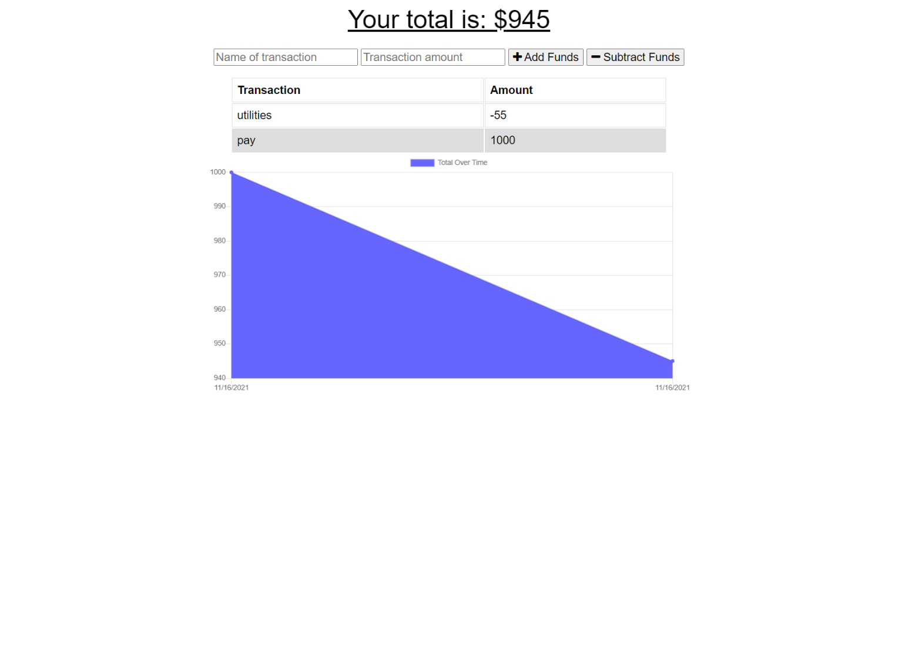
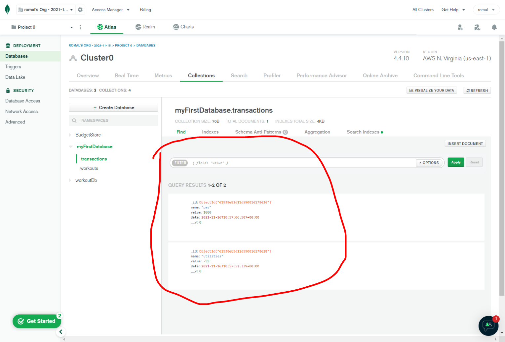
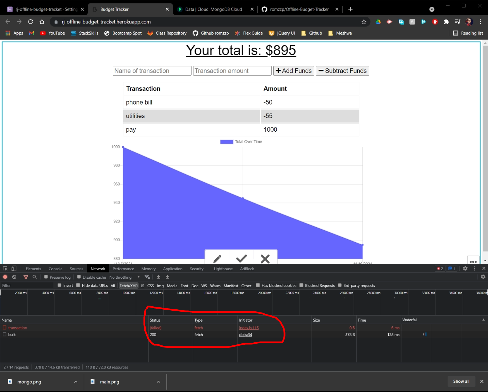

# Online/Offline_Budget_Tracker

Giving users a fast and easy way to track their money is important, but allowing them to access that information anytime is even more important. Having offline functionality is paramount to our applications success.

## Description

AS AN avid traveller
I WANT to be able to track my withdrawals and deposits with or without a data/internet connection
SO THAT my account balance is accurate when I am traveling

## Table of Contents

- [Installation](#installation)
- [Github Repository](#GithubRepository)
- [Link to the App](#App)
- [Screenshots](#Screenshots)
- [Questions](#questions)

## Installation

To install necessary dependencies, run the following command:

        npm i

## Github Repository

The link to the demo can be found [Repository](https://github.com/romzzp/Offline-Budget-Tracker).

## App

The link to the app can be found [App](https://rj-offline-budget-tracket.herokuapp.com/).

## Screenshots

The landing page

MongoDB

Offline access

## Questions

If you have any questions regarding the application you can reach me at [github](https://github.com/romzzp) or at my email : romzz.patel@gmail.com.
